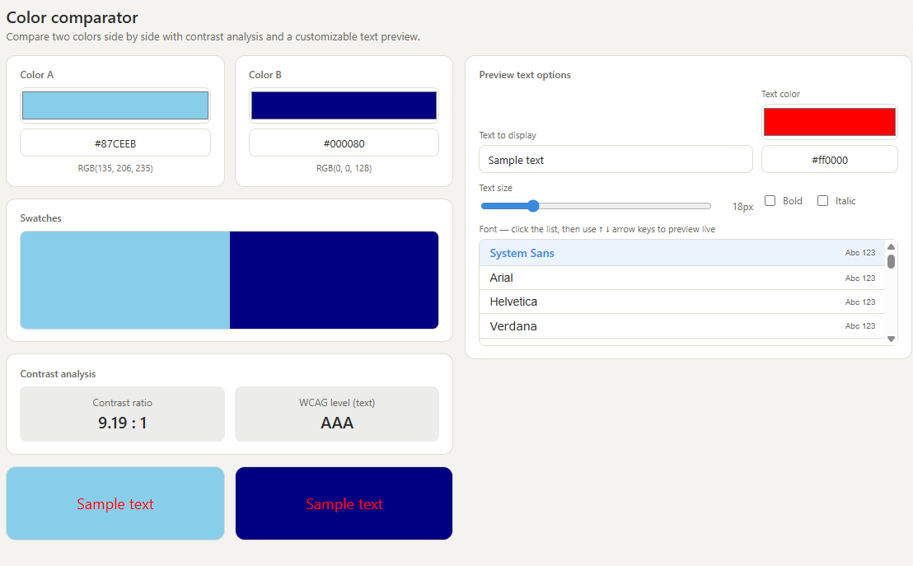

#  Color Comparator

A free, lightweight, browser-based tool to compare two colors side by side, check **WCAG contrast ratios**, and preview custom text in dozens of fonts — no installation, no dependencies, no build step.

**[Live demo →](https://github.com/HocineBenbara/Color-Comparator.git)**



##  Features

- **Side-by-side color swatches** — pick colors using native color pickers or type hex codes directly
- **RGB values** displayed automatically for both colors
- **WCAG contrast ratio calculator** — instantly shows the contrast ratio and accessibility level (AAA / AA / AA large text / Fail), so designers and developers can check text readability
- **Live text preview** on both color backgrounds
- **~49 fonts** with keyboard navigation — click the font list, then use `↑` / `↓` arrow keys to preview every font instantly
- **Text size slider** (10px–48px)
- **Bold and italic toggles**
- **Text color picker with hex input**
- Fully **responsive** — works on desktop and mobile
- **Single HTML file** — no frameworks, no build tools, no external requests (works offline)

##  Usage

### Option 1 — Try it online
Just open `index.html` in any modern browser, or visit the [GitHub Pages demo](#) once deployed.

### Option 2 — Run locally
```bash
git clone https://github.com/YOUR-USERNAME/YOUR-REPO-NAME.git
cd YOUR-REPO-NAME
open index.html   # or double-click the file
```

No server, no `npm install`, no dependencies required.

##  Deploying to GitHub Pages

1. Push this repository to GitHub.
2. Go to **Settings → Pages**.
3. Under **Source**, select the `main` branch and `/ (root)` folder.
4. Save. Your site will be live at `https://YOUR-USERNAME.github.io/YOUR-REPO-NAME/` within a minute or two.

##  Tech stack

- HTML5
- CSS3 (CSS variables, Grid, Flexbox — no preprocessor)
- Vanilla JavaScript (no frameworks, no libraries)

##  Accessibility notes

The contrast ratio is calculated using the [WCAG 2.1 relative luminance formula](https://www.w3.org/WAI/WCAG21/Understanding/contrast-minimum.html). Levels follow the standard thresholds:

| Ratio | Level |
|-------|-------|
| ≥ 7.0 | AAA |
| ≥ 4.5 | AA |
| ≥ 3.0 | AA (large text only) |
| < 3.0 | Fail |

##  Contributing

Issues and pull requests are welcome — for example, adding more fonts, color formats (HSL/CMYK), or an export-to-CSS feature.

##  License

MIT — free to use, modify, and distribute.
